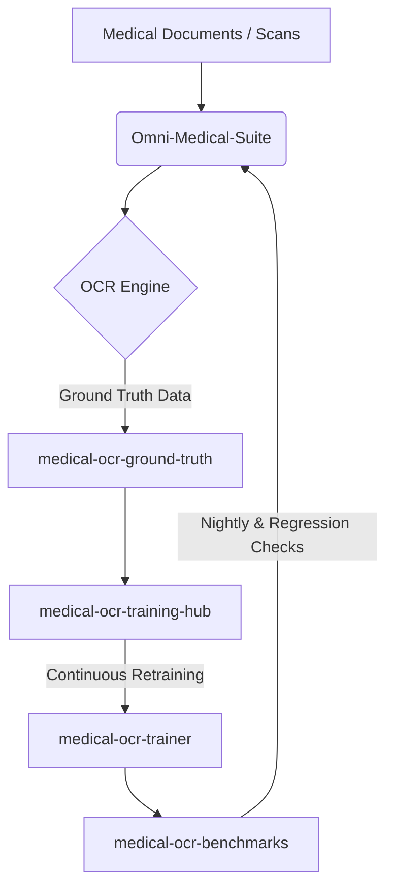

# Architectural Portfolio: Omni-Medical-Suite

Welcome to the technical portfolio of the **Omni-Medical-Suite** ecosystem. This document outlines the architecture, decision rules, and integrations that power our medical document processing pipelines.

---

## Ecosystem Architecture

The suite is a modular, data-driven network. Specialized repositories handle distinct lifecycle phases:

| Repository | Role | Status |
|:-----------|:-----|:-------|
| **omni-medical-suite** | Core engine — pipeline, layout analysis, text extraction | Active |
| **medical-ocr-ground-truth** | Single source of truth for verified datasets | Active |
| **medical-ocr-training-hub** | Ingestion bridge — validates & routes user feedback | Active |
| **medical-ocr-benchmarks** | Nightly regression testing & accuracy tracking | Active |
| **medical-ocr-trainer** | Model training & fine-tuning | Active |
| **telegram-forwarder** | Telegram content forwarding (Gradio/Telethon) | Active |
| **IntelliFile-app** | AI file classification (Manjaro Linux) | Active |
| Legacy repos (4) | Archived — migrated to omni-medical-suite | Archived |

---

## Data Lifecycle Flow

---

## Decision Rules

### 1. Document Ingestion
- Images below **150 DPI** are flagged for enhancement or rejected.
- Skewed scans undergo adaptive thresholding before OCR.

### 2. OCR Routing
- **Printed text** → standard OCR engines (fast, efficient).
- **Handwriting** → fine-tuned deep learning models (accurate, slower).

### 3. Privacy & PII
- All text passes through NER-based anonymization before public storage.
- Patient names, phone numbers, and dates are redacted automatically.
- No raw data enters ground truth without compliance validation.

### 4. Quality Gates
- Every model update must pass baseline benchmarks before production merge.
- Nightly regression checks prevent accuracy degradation.

### 5. Continuous Improvement
- User corrections from HF Spaces feed back into training data.
- Validated corrections trigger retraining cycles automatically.

---

## System Benchmarks

| Metric | Target | Tool |
|:-------|:-------|:-----|
| Character Error Rate (printed) | < 5% | medical-ocr-benchmarks |
| Character Error Rate (handwritten) | < 12% | medical-ocr-benchmarks |
| PII Redaction Accuracy | 100% on standard fields | NER Sanity Workflows |

---

*Maintained by [DrAbdulmalek](https://github.com/DrAbdulmalek)*