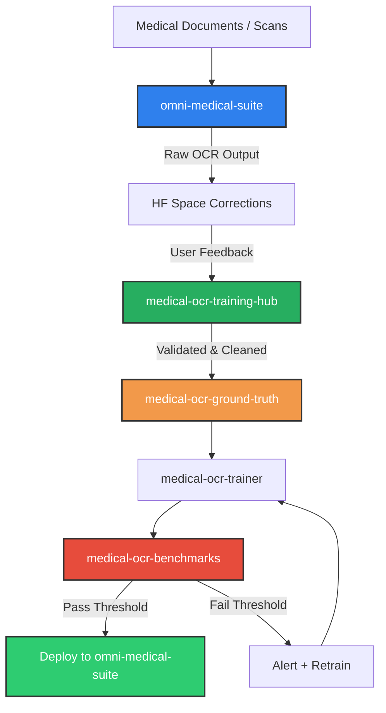

# Architectural Portfolio: Omni-Medical-Suite

Technical portfolio for the **Omni-Medical-Suite** ecosystem — a modular medical document processing platform with multi-engine OCR, NLP, and continuous learning.

---

## Architecture Overview

The suite is organized as a layered system. Each repository handles a distinct phase of the document lifecycle, from ingestion through deployment.

---

## Active Repositories

| Repository | Purpose |
|:-----------|:--------|
| **omni-medical-suite** | Core engine — OCR pipeline, layout analysis, text extraction, API |
| **medical-ocr-ground-truth** | Single source of truth for verified training datasets |
| **medical-ocr-training-hub** | Ingestion bridge — validates, scrubs PII, and routes corrections |
| **medical-ocr-benchmarks** | Nightly regression testing and accuracy threshold tracking |
| **medical-ocr-trainer** | Model training, fine-tuning, and experiment management |
| **telegram-forwarder** | Telegram content forwarding and management tool |
| **IntelliFile-app** | AI file classification desktop app (Manjaro Linux) |

> 4 legacy repositories have been archived. All active development lives in the repositories above.

---

## Five Decision Rules

1. **Resolution Gate** — Images below 150 DPI are flagged for enhancement or auto-rejected before OCR processing begins.

2. **OCR Routing** — Printed text routes to standard OCR engines (fast). Handwriting routes to fine-tuned deep learning models (accurate, slower).

3. **PII Redaction** — All patient identifiers (names, phones, dates, IDs) are redacted before any data enters public storage or ground truth.

4. **Quality Threshold** — Every model update must pass benchmarks (CER < 5% printed, < 12% handwritten) before merging to production.

5. **Continuous Learning** — User corrections from HF Spaces flow back through the training hub into ground truth, triggering retraining cycles automatically.

---

## Quality Benchmarks

| Metric | Target | Measured By |
|:-------|:-------|:------------|
| CER (printed) | < 5% | Nightly regression in medical-ocr-benchmarks |
| CER (handwritten) | < 12% | Nightly regression in medical-ocr-benchmarks |
| PII Redaction | 100% on standard fields | NER sanity workflows |

---

*Part of the [Omni-Medical-Suite](https://github.com/DrAbdulmalek/omni-medical-suite) ecosystem by [DrAbdulmalek](https://github.com/DrAbdulmalek)*