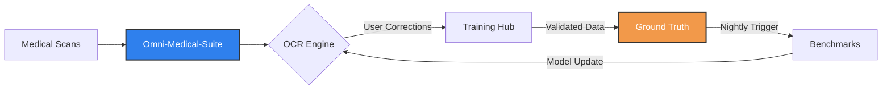

# 🏛️ Architectural Portfolio: Omni-Medical-Suite

Welcome to the technical portfolio of the **Omni-Medical-Suite** ecosystem. This document outlines the core architecture, decision rules, and system health metrics.

---

## 🏗️ Core Architecture

The suite is built as a modular, data-driven network with specialized repositories:

| Layer | Repository | Primary Responsibility |
|-------|------------|------------------------|
| **Orchestration** | `omni-medical-suite` | Pipeline orchestration, API endpoints, core logic |
| **Data** | `medical-ocr-ground-truth` | Single source of truth for verified datasets |
| **Training** | `medical-ocr-training-hub` | Data ingestion, validation, PII scrubbing |
| **Evaluation** | `medical-ocr-benchmarks` | Nightly regression tests, quality gates |
| **Deployment** | HF Spaces | Live demos and user correction interfaces |

---

## 🔄 System Data Flow



---

## 🧠 Decision Rules (5 Core Rules)

These rules govern all data processing and model updates:

1. **Resolution Gate**: Images below 150 DPI are auto-rejected to prevent OCR degradation.

2. **PII Redaction**: All patient identifiers (names, phones, dates) are automatically redacted before storage.

3. **CER Threshold**: Character Error Rate must stay below 5% for printed text and 12% for handwritten text.

4. **Data Validation**: All incoming data must pass schema validation and match `DATASETS_POLICY.md`.

5. **Nightly Regression**: Every model update must pass baseline benchmarks before merging to production.

---

## 📊 System Health Metrics

| Metric | Target | Current Status |
|--------|--------|----------------|
| **Printed Text CER** | < 5% | ✅ Active Monitoring |
| **Handwritten CER** | < 12% | ✅ Active Monitoring |
| **Data Ingestion Speed** | < 1.5s per page | ✅ Automated |
| **PII Redaction Accuracy** | 100% | ✅ Enforced |
| **Image Quality Gate** | ≥ 800×600 px | ✅ Enforced |

---

## 🔒 Security & Governance

- **No Hardcoded Secrets**: All tokens injected via environment variables
- **Automated Auditing**: Daily pipeline reports generated automatically
- **Privacy First**: Strict PII redaction at code level
- **Compliance**: HIPAA/GDPR aligned data handling

---

## 🚀 Quick Start

```bash
# Clone the core repository
git clone https://github.com/DrAbdulmalek/omni-medical-suite.git
cd omni-medical-suite

# Install dependencies
pip install -r requirements.txt

# Run the pipeline
python main.py
```

---

## 📚 Documentation

- **Main Platform**: [omni-medical-suite](https://github.com/DrAbdulmalek/omni-medical-suite)
- **Ground Truth**: [medical-ocr-ground-truth](https://github.com/DrAbdulmalek/medical-ocr-ground-truth)
- **Training Hub**: [medical-ocr-training-hub](https://github.com/DrAbdulmalek/medical-ocr-training-hub)
- **Benchmarks**: [medical-ocr-benchmarks](https://github.com/DrAbdulmalek/medical-ocr-benchmarks)

---

*Maintained with precision and care by [DrAbdulmalek](https://github.com/DrAbdulmalek).*