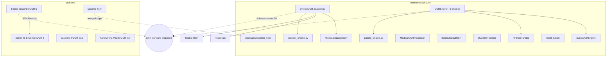

# MISTRAL REPOSITORY AUDIT — جرد وتدقيق مستودعات OCR
> التاريخ: 2026-09-28 | المدقق: Vibe (Mistral / GLM) | الحساب: DrAbdulmalek
> المنهجية: قراءة فقط (Read-only) أثناء الفحص. طريقة الوصول: GitHub MCP API + raw.githubusercontent.com + api.github.com (عام). لا استنساخ محلي — أوامر tree/grep/find استُبدلت بمكافئات API (موثق كقيد).
> الغرض: الأساس المعرفي لبناء المستودع المركزي **omni-ocr-core** بواجهة موحدة لكل محركات OCR.

---

## القسم 1: ملخص تنفيذي
- المستودعات المفحوصة: **7/7 موجودة وعامة**.
- محركات OCR المكتشفة: **12+ تعريف محرك/فئة** عبر 5 مستودعات (Tesseract، PaddleOCR، EasyOCR، TrOCR، Surya، Mistral-OCR، Mixed، Ensemble، HTR، Fusion؛ OLMoCR/Xberg قيد PRs غير مدمجة).
- عقود النتائج: **5 مخططات غير متوافقة** و**4 تمثيلات مختلفة لصندوق الكلمة** — تعارض جوهري يمنع التوحيد بدون طبقة Adapter.
- كود مكرر: ensemble_ocr.py شبه متطابق (~97%) بين trainer وtrainer-hf؛ ونظاما OCR موحّدان متوازيان داخل omni-medical-suite (adapter.py vs vision/ocr_engine.py).
- omni-medical-suite حجمه **1,325,276 KB (~1.3GB)** → فُعِّل شرط التوقف رقم 4 (جرد علوي + ملفات OCR المستهدفة فقط).
- ثلاث مشاكل أمنية معروفة **إصلاحاتها غير مدمجة في main**: PR #119 (pickle)، #118 (shell injection)، #130 (حجر Telegram Forwarder).

## القسم 2: جرد المستودعات

| # | المستودع | الحالة | الترخيص (ملف) | آخر commit | اللغة | الحجم |
|---|---|---|---|---|---|---|
| 1 | omni-medical-suite | نشط (archived:false) | MIT | 47ec48f853 — 2026-09-28 | Python | 1,325,276 KB ⚠️>1GB |
| 2 | arabic-medical-ocr-baseline | مؤرشف (UNPROVEN رسميًا: rate-limited) | **لا يوجد ملف LICENSE** ⚠️ | f89eb7fdb7 — 2026-07-07 | Python | 6 ملفات فقط |
| 3 | medical-handwriting-ocr | مؤرشف (archived:true) | MIT | 0b9c0102c5 — 2026-07-07 | Python | 738 KB |
| 4 | medical-ocr-trainer | مؤرشف (archived:true) | MIT | f2c4320810 — 2026-07-07 | Python | 261 KB |
| 5 | scanner-fixer | مؤرشف (archived:true) | MIT | 8ae7f9668e — 2026-07-07 | Python | 15,046 KB |
| 6 | medical-ocr-trainer-hf | نشط (archived:false) | MIT | 496936e897 — 2026-08-01 | Python | 113 KB |
| 7 | tg-campaign-toolkit | نشط | **لا يوجد ملف LICENSE** ⚠️ | 21ee570b0c — 2026-09-28 | Python | BLOCKED |

Evidence: api.github.com/repos (omni: size 1325276, archived:false؛ scanner-fixer/handwriting/trainer: archived:true) + جذر كل مستودع عبر GitHub MCP.
- ملاحظة أثرية: **أرشفة جماعية متعمدة 2026-07-07 بين 14:07:45–14:08:12** (4 مستودعات في <30 ثانية).

## القسم 3: محركات OCR

| # | المحرك | المستودع | الملف:السطر | الفئة | الاختبارات | Provenance | الحالة |
|---|---|---|---|---|---|---|---|
| 1 | UnifiedOCR (mixed→tesseract→mistral→easyocr) | omni | packages/omni_ocr/adapter.py:270 (OCRResult:57, OCREngineID:134) | موحّد | test_ocr.py, test_ocr_engine.py | ✅ (pdf_sha256, model, cloud, cost) | نشط |
| 2 | MixedLanguageOCR | omni | packages/omni_ocr/mixed_engine.py:22 | مختلط | — | ❌ | نشط |
| 3 | OCREngine (Surya+TrOCR+EasyOCR+Tesseract+Paddle) | omni | packages/vision/ocr_engine.py:29 (recognize:392, batch:489, pdf:526) | موسّع | test_htr.py | جزئي | نشط |
| 4 | SuryaOCREngine | omni | packages/vision/surya_ocr.py:27 | مفرد | — | ❌ | نشط |
| 5 | PaddleOCREngine (عربي محسّن) | omni | src/ocr/paddle_engine.py:53 | مفرد | — | ❌ | نشط |
| 6 | EasyOCREngine | omni | src/ocr/easyocr_engine.py:32 | مفرد | — | ❌ | نشط |
| 7 | MedicalOCRProcessor | omni | packages/vision/medical_ocr.py:28 | معالج طبي | — | ❌ | نشط |
| 8 | BatchMedicalOCR | omni | packages/vision/batch_ocr.py:19 | دفعات | — | ❌ | نشط |
| 9 | DualOCRVerifier | omni | packages/vision/dual_ocr_verifier.py:24 | تحقق مزدوج | — | ❌ | نشط |
| 10 | FineTunedTrOCR + ArabicHTR | omni | packages/vision/htr/trocr_finetuned.py:25, htr/arabic_htr.py:56 | خط يدوي | test_htr.py | ❌ | نشط |
| 11 | EnsembleOCR (Paddle:195, Easy:269, Tesseract:336, TrOCR~415, Surya) | trainer | ensemble_ocr.py | تجميعي | test_metrics.py فقط ⚠️ | ❌ | مؤرشف |
| 12 | EnsembleOCR-lite (3 محركات) | trainer-hf | ensemble_ocr.py | تجميعي | **لا اختبارات** | ❌ | نشط |
| 13 | TrOCR eval (microsoft/trocr-base-handwritten) | baseline | eval_benchmark.py:272 | تقييم | ❌ | ❌ | مؤرشف |
| 14 | PaddleOCR Streamlit lite | handwriting | app.py:27 | مفرد | tests/ غير مفحوصة | ❌ | مؤرشف |
| 15 | OLMoCR + Xberg | omni | **PR #135 مفتوح — غير موجود في main** | — | — | — | PENDING |
| 16 | scanner-fixer (تطبيع صور قبل OCR) | scanner-fixer | src/scanner_fixer/ (pipeline, deskew, enhance, rotate, crop, batch_pipeline) | معالجة صور | test_scanner_fixer.py | — | مؤرشف + نسخة packages/scanner_fixer/ في omni |

ملاحظة: لا وجود لـ Qari/Nougat/Qwen في أي ملف مفحوص (OLMoCR عبر docs/olmocr-xberg-verification + PRs #134/#135 فقط).

## القسم 4: تحليل Contract (التعارض الجوهري)

| المخطط | الملف:السطر | الحقول المميزة | Provenance |
|---|---|---|---|
| A: OCRResult | omni: packages/omni_ocr/adapter.py:57-93 | text, confidence, engine, word_count, processing_time, words(List[Dict]), raw_result, error + **P0: confidence_is_estimate, pdf_sha256, model, cloud, cost_estimate_usd** | ✅ كامل |
| B: OcrWord/EngineResult/EnsembleWord/EnsembleResult | trainer: ensemble_ocr.py:76,94,118,142 | bbox:[[x,y]×4], engine_votes, agreement_count, strategy | ❌ |
| C: WordResult/LineResult/PageResult/DocumentResult | omni: packages/vision/result_fusion.py:71,85,105,121 | كتل نصية + BoundingBox كائن | ❌ |
| D: HTRResult/LineResult/WordResult | omni: packages/vision/htr/arabic_htr.py:56,74,95 | lines, y_start/y_end, image(PIL) | ❌ |
| E: WordResult | omni: packages/omni_ocr/mixed_engine.py:12 | أبسط مخطط | ❌ |

| الحقل | A | B | C | D | متوافق؟ |
|---|---|---|---|---|---|
| الإحداثيات | x,y,w,h (Dict) | bbox [[x,y]×4] | BoundingBox كائن | bbox غير موحد | ❌ **4 تمثيلات** |
| Provenance | ✅ P0 كامل | ❌ | ❌ | ❌ | ❌ |
| النص الكامل | text: str | كلمات فقط | DocumentResult | text: str | ⚠️ |

**التوصية المعمارية**: اعتماد مخطط A (adapter.py OCRResult) نواةً لـ omni-ocr-core (الوحيد بـ Provenance)، مع adapters من B/C/D/E.

## القسم 5: الاعتماديات والتعارضات

| الحزمة | omni | trainer | trainer-hf | scanner-fixer | الموصى به |
|---|---|---|---|---|---|
| paddleocr | (طبقات، غير موثق صراحة) | >=2.7.0 | >=2.7.0 | — | >=2.7.0 |
| pytesseract | >=0.3.10 (requirements/ml.txt) | >=0.3.10 | >=0.3.10 | >=0.3 optional | >=0.3.10 |
| numpy | >=1.24.0 (base.txt) | >=1.24.0 | **>=1.24.0,<2.0.0** | >=1.23 | توحيد السقف |
| streamlit | — | >=1.38.0 | **==1.38.0** | — | >=1.38.0 |
| pillow | >=10.0.0 | >=10.0.0 | >=10.0.0 | >=9.0 | >=10.0.0 |
| easyocr | — | معلق بتعليق | >=1.7.0 | — | >=1.7.0 |

- C-001 numpy: سقف <2.0.0 في hf فقط — MEDIUM.
- C-002 streamlit: == مقابل >= — LOW.
- C-003 تبعية git مباشرة: medical-ocr-benchmarks@main (trainer requirements.txt:47) — HIGH (المستودع الهدف موجود).
- requirements.txt الجذري في omni واجهة legacy تشير إلى requirements/{api,ml,base,optional,dev}.txt.

## القسم 6: الأمان

| ID | الشدة | النوع | الموقع | الوصف | الحالة |
|---|---|---|---|---|---|
| S-001 | HIGH | DESERIALIZATION | PR #119 مفتوح | pickle غير آمن في main، الإصلاح غير مدمج | OPEN |
| S-002 | HIGH | INJECTION | PR #118 مفتوح | shell injection في git config helpers | OPEN |
| S-003 | MEDIUM | SECRET_HYGIENE | .env.example/.env.api.example/.env.web.example/env.example.production (omni) + .env.test (handwriting) | ملفات env نموذجية مرفوعة؛ قيمها لم تُفحص | OPEN/NOT_EXECUTED |
| S-004 | MEDIUM | THIRD_PARTY | PR #130 مفتوح | حجر Telegram Forwarder | OPEN |
| S-005 | LOW | API_KEY | adapter.py:316,356,861 | mistral_api_key كبارامتر اختياري | OPEN (تصميمي) |
| S-006 | INFO | SUBPROCESS | adapter.py:233, ocr_engine.py:207 | tesseract --version بوسائط ثابتة | FALSE_POSITIVE |

grep على sk-/ghp_/AKIA في الملفات المفحوصة: لا نتائج. secret scanning شامل: NOT_EXECUTED (قيد 1.3GB).

## القسم 7: الكود المكرر

| # | A | B | النتيجة | الإجراء |
|---|---|---|---|---|
| 1 | trainer/ensemble_ocr.py (971 سطر، md5 7245be5f) | trainer-hf/ensemble_ocr.py (972 سطر، md5 ce63d96e) | نفس الحجم 32,798B؛ فرق وحيد: حذف كتلة Optional Engine Dependencies (23 سطرًا) في hf | NEAR-DUP ~97% → مصدر واحد في omni-ocr-core |
| 2 | packages/omni_ocr/adapter.py (966) | packages/vision/ocr_engine.py (997) | نفس البايتات 32,793 لكن محتوى مختلف كليًا | NOT duplicate — لكن **تكرار وظيفي**: نظاما OCR موحّدان متوازيان يجب دمجهما |
| 3 | DUPLICATE_FILES_REPORT.txt (104KB في جذر omni) | — | يوثق حذف 85 ملفًا مكررًا 100% سابقًا (OPEN_ISSUES.md) | دليل مساند |

## القسم 8: Dependency Graph

## القسم 9: الأخطاء المزمنة
| # | النمط | الشدة | الأدلة |
|---|---|---|---|
| 1 | except Exception فضفاض | MEDIUM | ocr_engine=12، adapter=11، ensemble=11 (كلا المستودعين)؛ لا يوجد except: عارٍ (جيد) |
| 2 | TODO/FIXME | LOW | لا نتائج في الملفات المفحوصة |
| 3 | مسارات صلبة | LOW | لا نتائج في الملفات المفحوصة |
| 4 | إهمال نظافة الجذر | MEDIUM | 40+ ملف تقرير/سجل في جذر omni (worklog 30KB، PARTIAL_DUPLICATES 159KB، project_context ~1.4MB) |
| 5 | مستودع >1GB | HIGH | 1.3GB داخل git (سكربتات LFS موجودة كمحاولة معالجة) |

## القسم 10: الملفات اليتيمة (جزئي)
- BLOCKED للتحليل الكامل. ملفا src/ocr/deduplication_pipeline.py وbuild_medical_dict.py: SUSPECT (لم يُستورَدا في الملفات المفحوصة). MISSING_SOURCE_FILES.md + LEGACY_REVIEW_FINAL.md في omni توثقان مشاكل سابقة.

## القسم 11: المؤرشفة مقابل النشطة
- الأرشفة الجماعية: 2026-07-07 (4 مستودعات، <30 ثانية).
- scanner-fixer → packages/scanner_fixer/ في omni: نُقل. PROVEN.
- trainer → trainer-hf: نسخة مشتقة مخففة لطبقة HF المجانية (حذف TrOCR/Surya). PROVEN.
- arabic-medical-ocr-baseline: لا نظير واضح كملف مستقل؛ وظيفته نُقلت جزئيًا إلى benchmarks/ وevaluation/. PARTIAL. CONTENT_LOST: BLOCKED.

## القسم 12: PRs و Issues
- omni-medical-suite: 20+ PR مفتوحًا جُلبت: #136 TrOCR training، #135 Xberg+OLMoCR، #134 تحقق، #133 نقل تقارير، #132/#131/#130 أمنية، #125/#124 تصحيحات، #123 أمن P0، #119 pickle، #118 shell injection، #120/#121/#117 ميزات، +7 dependabot.
- Issues عبر API: فشل الجلب (ERR). البديل: OPEN_ISSUES.md (تحديث 2026-07-14) يوثق ~18 ملف CATEGORY_B معلقًا وقرارات مراجعة بشرية.
- trainer-hf: لا PRs. tg-campaign-toolkit: PR #1 مفتوح.
- فروع omni: 29 فرعًا (audit/*, docs/*, dependabot/*, backup/*).

## القسم 13: الاختبارات
| المستودع | ملفات الاختبار | التقييم |
|---|---|---|
| omni-medical-suite | 60+ ملف test_* + conftest + tests/security/ | منظم؛ تصنيف REAL/MOCKED: NOT_EXECUTED |
| medical-ocr-trainer | test_metrics.py فقط | تغطية شبه معدومة للمحركات |
| medical-ocr-trainer-hf | لا مجلد tests | ❌ |
| scanner-fixer | test_scanner_fixer.py (pytest في pyproject) | واحدة |
| medical-handwriting-ocr | tests/ + pytest.ini | PARTIAL (غير مفحوصة تفصيلًا) |

## القسم 14: التوصيات لبناء omni-ocr-core
1. اعتمد OCRResult (adapter.py:57) عقدًا موحدًا — الوحيد بـ Provenance P0.
2. انقل محركات ocr_engine.py + ensemble_ocr.py (نسخة trainer الكاملة) كخلفيات خلف الواجهة، مع adapters للمخططات B/C/D.
3. PR #136/#135 يضيفان TrOCR pipeline وOLMoCR/Xberg — غير مدمجين في main: راجعهما قبل البناء.
4. أغلق S-001/S-002 (ادمج PR #119/#118) قبل إعادة استخدام الكود.
5. وحّد numpy (<2.0.0) واحذف تبعية git المباشرة (C-003).
6. أدمج scanner-fixer كطبقة معالجة قبل OCR (نسختان موجودتان).

## القسم 15: ما لم أستطع الوصول إليه (صراحة تامة)
1. لا استنساخ محلي → لا radon/pylint/pydeps/عدّ أسطر شامل/MI.
2. شرط التوقف 4 فُعِّل (1.3GB): قراءة 16 ملفًا مستهدفًا فقط في omni.
3. api.github.com العام: نفد rate limit أثناء الفحص → فشل metadata لـ arabic-medical-ocr-baseline وtg-campaign-toolkit.
4. list_issues عبر MCP: فشل (ERR).
5. تصنيف كل اختبار REAL/MOCKED/STUB: NOT_EXECUTED.
6. فحص قيم .env.*: NOT_EXECUTED.
7. عدّ الاستيرادات الشامل لليتامى: BLOCKED (يتطلب استنساخ).

## القسم 16: أدلة مساندة
- كل مسار:سطر أعلاه مقروء فعليًا من raw.githubusercontent.com (ملفات محفوظة أثناء الفحص).
- md5: ensemble trainer=7245be5fd426de216ecd9369f4f82cc1، hf=ce63d96e4d94df09bb85329f411d9080 (كلاهما 32,798B).
- adapter.py=32,793B وvision/ocr_engine.py=32,793B (تطابق رقمي مصادفة، المحتوى مختلف).
- status labels: PROVEN / PARTIAL / UNPROVEN / BLOCKED / NOT_EXECUTED.
