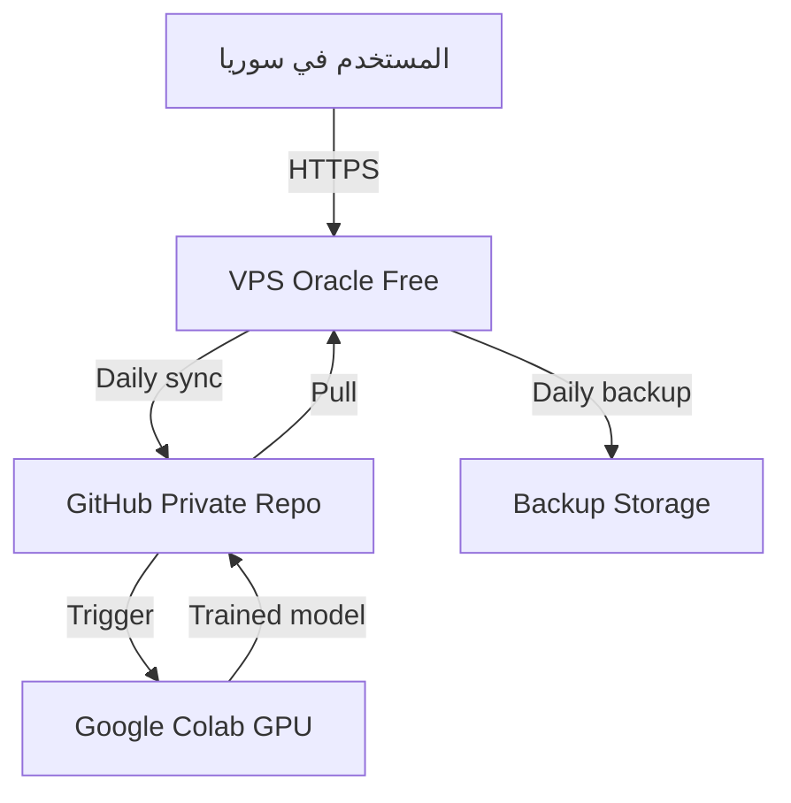

<!-- المصدر: محادثة DeepSeek 2873vzbqibqh1ihe31 — رسالة 73 | حُفظ: 2026-10-08 -->

# Future Infrastructure Plan — VPS/Oracle/Codespaces (TEMPLATES ONLY)

# MASTER PROMPT — Future Infrastructure & Deployment Plan
## Omni Medical Suite — Documentation Package (No Execution)

> **تعليمات:** انسخ كل ما أسفل هذا السطر وأرسله إلى الوكيل المنفذ (Z.ai) **كما هو**. هذا البرومبت **للتوثيق فقط** — لا كود، لا تنفيذ، لا تثبيت، لا اتصال بأي خدمة.

---

## 0. الهوية والنطاق

أنت تعمل كـ:

- **Documentation Engineer**
- **DevOps Architect (Planning Only)**
- **Cloud Cost Analyst**
- **Security & Privacy Auditor**
- **CI/CD Planner**

المستودع المستهدف:

```
/home/z/my-project/repos/omni-medical-suite
```

**المهمة:** إضافة حزمة توثيق مستقبلية شاملة تغطي:

1. **البنية التحتية السحابية** (VPS Options + Hybrid Architecture).
2. **GitHub Codespaces** (تشغيل فوري في المتصفح).
3. **Oracle Cloud Deployment Kit** (حزمة نشر كاملة).
4. **VPS ↔ Colab Training Pipeline** (تدريب تلقائي).

**نمط التنفيذ:** `DOCUMENTATION_ONLY` — لا كود، لا تنفيذ، لا تعديل ملفات production.

---

## 1. القواعد المطلقة

### 1.1 ممنوع تماماً

- ❌ تعديل أي ملف كود (`*.py`, `*.html`, `Dockerfile`, `docker-compose.yml`, `requirements.txt`).
- ❌ تثبيت أي حزمة (`pip`, `npm`, `apt`, `docker`).
- ❌ تشغيل أي خدمة (`server.py`, `train_server.py`, `segment.py`).
- ❌ تعديل `main` أو أي محرك OCR قائم.
- ❌ الاتصال بأي خادم VPS أو Oracle أو Colab.
- ❌ توليد أي credential حقيقي (GPG keys، API tokens، إلخ).
- ❌ تنزيل أي نموذج أو أوزان.
- ❌ رفع أي بيانات حقيقية أو PHI.
- ❌ ادعاء أن أي شيء "مُنفَّذ" أو "يعمل" أو "مُختبر".
- ❌ تشغيل أي سكربت من السكربتات المُنشأة.
- ❌ استخدام `git clean`, `git reset --hard`, `git push --force`.

### 1.2 مسموح

- ✅ إنشاء ملفات Markdown وTemplates داخل `docs/future/`.
- ✅ إنشاء ملفات `.devcontainer/` و `.gitpod.yml` (كملفات إعداد فقط).
- ✅ إنشاء سكربتات داخل `deploy/`, `automation/` كـ **Templates** (لا تُنفَّذ).
- ✅ إنشاء قوالب GitHub Actions workflows (لا تُشغَّل).
- ✅ قراءة المشروع الحالي لفهم نقاط التكامل.
- ✅ إضافة قسم في `README.md` الرئيسي بعنوان "Future Roadmap".
- ✅ تحديث `.gitignore` لحماية المجلدات المستقبلية.
- ✅ commit التوثيق فقط في فرع منفصل.
- ✅ push إلى GitHub (لحفظ الوثائق).

### 1.3 الفرع

```
feature/future-infrastructure-plan
```

إذا كان موجوداً، أبلغ عنه ثم استخدمه. **لا تلمس `main`.**

---

## 2. Pre-Flight (إلزامي)

نفّذ الأوامر التالية وسجّل المخرجات:

```bash
git -C /home/z/my-project/repos/omni-medical-suite status
git -C /home/z/my-project/repos/omni-medical-suite branch --show-current
git -C /home/z/my-project/repos/omni-medical-suite log -n 5 --oneline
ls -la /home/z/my-project/repos/omni-medical-suite/docs/ 2>/dev/null
ls -la /home/z/my-project/repos/omni-medical-suite/.devcontainer 2>/dev/null
ls -la /home/z/my-project/repos/omni-medical-suite/deploy 2>/dev/null
ls -la /home/z/my-project/repos/omni-medical-suite/automation 2>/dev/null
cat /home/z/my-project/repos/omni-medical-suite/.gitignore 2>/dev/null
find /home/z/my-project/repos/omni-medical-suite -maxdepth 2 -name "*.py" | head -20
```

**إذا لم يوجد المستودع:** STOP. أبلغ. لا تخمّن.

**إذا كان Worktree غير نظيف:** أبلغ فقط. **لا تنظّف.** أنشئ فرعاً جديداً من HEAD الحالي.

**إذا كان الفرع المستهدف موجوداً:** أبلغ. لا تستبدله. ادمج في الحزمة.

---

## 3. المخرجات المطلوبة

أنشئ الهيكل التالي مع كل الملفات:

```
docs/future/
├── README.md                                    ← نظرة عامة على الحزمة كاملة
│
├── vps/                                         ← حزمة VPS الأساسية
│   ├── README.md
│   ├── FREE_VPS_OPTIONS.md
│   ├── HYBRID_ARCHITECTURE.md
│   ├── INTEGRATION_POINTS.md
│   ├── COST_ANALYSIS.md
│   ├── RISK_REGISTER.md
│   ├── SECURITY_CHECKLIST.md
│   ├── PRIVACY_COMPLIANCE.md
│   ├── ROLLOUT_ROADMAP.md
│   ├── ALTERNATIVES.md
│   ├── FAQ.md
│   └── DEPLOYMENT_RUNBOOK.md
│
├── codespaces/                                  ← حزمة Codespaces
│   ├── README.md
│   ├── SETUP_GUIDE.md
│   └── TROUBLESHOOTING.md
│
├── oracle/                                      ← حزمة Oracle Deployment
│   ├── README.md
│   ├── 00-prerequisites.md
│   ├── 01-oracle-account-setup.md
│   ├── 02-server-provisioning.md
│   ├── 03-initial-hardening.md
│   ├── 04-install-dependencies.md
│   ├── 05-clone-and-configure.md
│   ├── 06-setup-nginx.md
│   ├── 07-setup-ssl.md
│   ├── 08-setup-systemd.md
│   ├── 09-setup-backup.md
│   ├── 10-verify-deployment.md
│   ├── 11-troubleshooting.md
│   └── ROLLBACK_PLAN.md
│
└── colab-pipeline/                              ← حزمة VPS ↔ Colab
    ├── README.md
    ├── ARCHITECTURE.md
    ├── SECURITY.md
    ├── VPS_SETUP.md
    ├── COLAB_SETUP.md
    ├── GITHUB_SETUP.md
    └── WORKFLOW.md

.devcontainer/
├── devcontainer.json                            ← للـCodespaces
├── Dockerfile
└── post-create.sh

.gitpod.yml                                      ← بديل لـCodespaces

deploy/
├── oracle/
│   ├── 01-initial-hardening.sh.template
│   ├── 02-install-dependencies.sh.template
│   ├── 03-clone-and-configure.sh.template
│   ├── 04-setup-nginx.sh.template
│   ├── 05-setup-ssl.sh.template
│   ├── 06-setup-systemd.sh.template
│   ├── 07-setup-backup.sh.template
│   ├── 08-verify-deployment.sh.template
│   ├── rollback.sh.template
│   └── update.sh.template
│
└── configs/
    ├── nginx-ahw.conf.template
    ├── ahw-correction.service.template
    ├── ahw-training.service.template
    └── .env.template

automation/
├── vps/
│   ├── 01-export-dataset.sh.template
│   ├── 02-encrypt-and-push.sh.template
│   ├── 03-pull-and-validate-model.sh.template
│   ├── 04-promote-or-rollback.sh.template
│   └── crontab.template
│
├── colab/
│   └── train_arabic_trocr.ipynb.template
│
├── github/
│   └── workflows/
│       ├── trigger-training.yml.template
│       └── validate-model.yml.template
│
└── shared/
    ├── encrypt.sh.template
    ├── decrypt.sh.template
    └── validate_model.py.template

scripts/
├── codespaces_smoke_test.sh.template
└── future_validate.sh.template

README.md                                        ← تحديث فقط (قسم جديد)
.gitignore                                       ← تحديث فقط
```

**⚠️ ملاحظة مهمة:** كل ملف `.sh.template` أو `.py.template` أو `.yml.template` يجب أن يحمل في أول 3 أسطر:

```
# STATUS: TEMPLATE ONLY — NOT EXECUTED
# PHASE: FUTURE (V-1 through V-7)
# TESTED: NO
```

هذا يمنع أي تشغيل عرضي.

---

## 4. تفاصيل كل حزمة

### 4.1 `docs/future/README.md` (البوابة الرئيسية)

يحتوي:

- **الملخص التنفيذي:** لماذا هذه الحزمة؟ ما الذي تغطيه؟
- **جدول المحتويات:** روابط لكل الحزم الفرعية.
- **الحالة:** `PLANNED — NOT IMPLEMENTED`.
- **الجدول الزمني المقترح:** مراحل بأسبوع/شهر.
- **تحذير بارز:** "هذه وثائق تخطيط فقط، لا شيء منها منفَّذ."
- **شجرة الملفات:** رسم بياني للهيكل.

---

### 4.2 `docs/future/vps/` (حزمة VPS الأساسية)

#### `README.md`

- نظرة عامة على الحزمة.
- روابط للملفات الفرعية.
- ملخص سريع لـ"ماذا، لماذا، متى".

#### `FREE_VPS_OPTIONS.md`

جدول تفصيلي لكل مزود:

| المزود | المواصفات | المدة | بطاقة؟ | متوافق مع سوريا؟ | الاستخدام الأمثل |
|---|---|---|---|---|---|
| Oracle Cloud Always Free | 4 ARM cores, 24GB RAM, 200GB | دائم | نعم (للتحقق) | صعب لكن ممكن | خادم إنتاجي كامل |
| Google Cloud e2-micro | 1 vCPU, 1GB RAM, 30GB | دائم | نعم | متوسط | خادم خفيف |
| AWS Free Tier | t2.micro/t3.micro | 12 شهر | نعم | سهل | تجربة مؤقتة |
| GitHub Codespaces | 2 vCPU, 8GB RAM, 32GB | 60 ساعة/شهر | لا | سهل جداً | التطوير الفوري |
| Google Colab | GPU T4 | محدود يومياً | لا | سهل | التدريب فقط |
| Hugging Face Spaces | متغير | دائم | لا | سهل | استضافة نماذج فقط |
| Fly.io | مشترك | محدود | لا | متوسط | بديل جيد |
| Railway | محدود | محدود | لا | متوسط | تجارب |

**لكل مزود أضف:**

- رابط الموقع الرسمي.
- خطوات التسجيل التفصيلية.
- التحديات المتوقعة.
- الحلول البديلة.
- ما يصلح له (خادم دائم، تطوير، تدريب).
- حكم واضح: **مناسب لسوريا؟ نعم/لا/بشروط.**

**قسم خاص:** "تجاوز مشكلة الدفع من سوريا" — عنوان بديل، بطاقة prepaid، USDT، صديق في الخارج، إلخ.

#### `HYBRID_ARCHITECTURE.md`

Diagram (Mermaid):



شرح كل مكوّن:

- **الدور**
- **المسؤوليات**
- **الموارد**
- **التكلفة**
- **التواصل**
- **حالة الفشل**
- **النسخ الاحتياطي**

**تدفق البيانات:** سير عمل تفصيلي لحالتين:

1. تصحيح يومي.
2. تدريب دوري.

#### `INTEGRATION_POINTS.md`

جدول شامل:

| الملف الحالي | التكامل | التعديل | الأولوية | الحالة |
|---|---|---|---|---|
| `server.py` | يعمل على VPS | لا تعديل | CRITICAL | NOT NOW |
| `segment.py` | عند الرفع | لا تعديل | HIGH | NOT NOW |
| `train_server.py` | على Colab | لا يعمل على VPS | HIGH | NOT NOW |
| `corrections.db` | ينتقل إلى VPS | نسخ + تحقق | CRITICAL | NOT NOW |
| `Dockerfile` | جديد | يُنشأ | MEDIUM | NOT NOW |
| `Nginx config` | جديد | يُنشأ | HIGH | NOT NOW |
| `systemd service` | جديد | يُنشأ | HIGH | NOT NOW |
| `Backup script` | جديد | يُنشأ | HIGH | NOT NOW |
| `Monitoring` | Uptime Robot | خارجي | MEDIUM | NOT NOW |

**لكل بند:** الخطوات، الأوامر، الملفات المتوقعة، المخاطر. **⚠️ صراحة:** `IMPLEMENTATION: NOT NOW — PLANNED FOR PHASE V-X`.

#### `COST_ANALYSIS.md`

جدول شهري/سنوي:

| السيناريو | VPS | Colab | التخزين | الإجمالي/شهر |
|---|---|---|---|---|
| مجاني بالكامل | Oracle Free | Colab Free | GitHub Free | $0 |
| مختلط | Oracle Free | Colab Pro | GitHub Pro | ~$20 |
| متقدم | VPS GPU | Colab Pro+ | S3 | ~$150 |

#### `RISK_REGISTER.md`

| المخاطرة | الشدة | الاحتمال | التخفيف |
|---|---|---|---|
| فقدان بيانات VPS | HIGH | متوسطة | نسخ يومية |
| اختراق VPS | CRITICAL | منخفضة | SSH keys + SSL + Fail2Ban |
| Oracle يرفض الحساب | MEDIUM | عالية | بديل: Codespaces |
| PHI leak عبر الشبكة | CRITICAL | منخفضة | HTTPS + تشفير محلي |

#### `SECURITY_CHECKLIST.md`

- [ ] SSH keys فقط.
- [ ] جدار ناري (ufw).
- [ ] HTTPS إلزامي.
- [ ] Fail2Ban.
- [ ] تحديثات أمنية تلقائية.
- [ ] Backup مشفّر.
- [ ] لا PHI على VPS عام.
- [ ] API Key في `.env`.
- [ ] Rate limiting.
- [ ] Logs بدون معلومات حساسة.

#### `PRIVACY_COMPLIANCE.md`

- **مسموح:** بيانات اصطناعية، Demo، كود مفتوح.
- **ممنوع:** PHI، بيانات مرضى، صور حقيقية.
- **إذا لا مفر:** VPS خاص + تشفير + GDPR.

#### `ROLLOUT_ROADMAP.md`

| المرحلة | المدة | المخرج | شرط الانتقال |
|---|---|---|---|
| V-0 | أسبوع | تسجيل Oracle | نجاح التسجيل |
| V-1 | أسبوع | SSH + Nginx + SSL | اتصال آمن |
| V-2 | أسبوع | نشر server.py | يعمل 24/7 |
| V-3 | أسبوع | Migration DB | البيانات كاملة |
| V-4 | أسبوع | Backup + Monitoring | إشعارات تعمل |
| V-5 | أسبوع | Docker (Stirling/Xberg) | حاويات تعمل |
| V-6 | أسبوع | Colab integration | تدريب تلقائي |
| V-7 | أسبوع | Full production | كل شيء مستقر |

#### `ALTERNATIVES.md`

- إذا فشل Oracle → Codespaces + Colab + GH Actions.
- إذا احتجت GPU → Colab Pro، RunPod، Vast.ai.
- إذا احتجت تخزين كبير → Backblaze B2، Cloudflare R2.

#### `FAQ.md`

10 أسئلة على الأقل:

- هل VPS آمن لبيانات المرضى؟
- ماذا لو فقدت الـVPS؟
- كيف أنقل البيانات من جهازي؟
- كم تكلفة سنوية فعلية؟
- هل أحتاج خبرة Linux؟
- ماذا لو رُفض طلب Oracle؟
- هل VPS أسرع من جهازي؟
- كيف أستعيد العمل بعد إعادة تعيين البيئة؟

#### `DEPLOYMENT_RUNBOOK.md`

Templates (داخل code blocks):

- Oracle Cloud Setup.
- Nginx Config.
- SSL Setup.
- Systemd Service.
- Backup Script.
- Cron Jobs.
- Colab Integration.

**⚠️ في نهاية كل Template:**

```
STATUS: TEMPLATE ONLY — DO NOT EXECUTE
PHASE: V-X (planned)
```

---

### 4.3 `docs/future/codespaces/` (حزمة Codespaces)

#### `README.md`

- لماذا Codespaces؟
- المواصفات المجانية (2 vCPU, 8GB, 60 ساعة/شهر).
- ما يعمل وما لا يعمل.
- حد 60 ساعة/شهر.
- تحذير: لا PHI.

#### `SETUP_GUIDE.md`

خطوات تفصيلية:

1. افتح المستودع على GitHub.
2. Code → Codespaces → Create.
3. انتظر ~3 دقائق.
4. افتح Terminal → `python server.py --sample S001`.
5. Ports → افتح 5000.
6. ابدأ التصحيح من أي جهاز.

مع **screenshots وصفية** (كتابة).

#### `TROUBLESHOOTING.md`

- بطء في الفتح.
- فشل تثبيت متطلبات.
- Port forwarding لا يعمل.
- انتهى 60 ساعة.
- Python import errors.

---

### 4.4 `docs/future/oracle/` (حزمة Oracle Deployment)

#### `README.md`

- ملخص الحزمة.
- المتطلبات المسبقة.
- الجدول الزمني (أسبوع).
- خطوات التسجيل من سوريا (بالتفصيل).
- تحذير بارز: **"لا تُنفّذ على بيانات حقيقية حتى تتحقق من الأمان."**

#### `00-prerequisites.md` → `11-troubleshooting.md`

كل ملف يشرح خطوة من خطوات النشر:

- **00:** ما تحتاجه قبل البدء (حساب، بطاقة، إلخ).
- **01:** تسجيل Oracle Cloud (خطوات مفصلة + مشاكل التسجيل من سوريا).
- **02:** إنشاء VM (ARM Ampere, Ubuntu 22.04).
- **03:** تأمين أولي (SSH keys، ufw، fail2ban).
- **04:** تثبيت Python، Nginx، Git، Docker.
- **05:** استنساخ المشروع، venv، تثبيت المتطلبات.
- **06:** إعداد Nginx كـreverse proxy.
- **07:** SSL عبر Let's Encrypt.
- **08:** Systemd service للـserver.
- **09:** Backup تلقائي.
- **10:** التحقق من النشر.
- **11:** حل المشاكل الشائعة.

#### `ROLLBACK_PLAN.md`

- متى نرجع؟
- كيف نرجع؟
- استعادة backup.
- استعادة النموذج السابق.
- الاتصال بالمستخدم.

---

### 4.5 `docs/future/colab-pipeline/` (حزمة VPS ↔ Colab)

#### `README.md`

- لماذا pipeline؟
- التحديات (بيانات كبيرة، GPU، تكلفة).
- الحل: GitHub Private كوسيط.

#### `ARCHITECTURE.md`

Diagram تفصيلي:

```
VPS (SQLite corrections.db)
    │
    │ 1. Export daily/weekly (cron)
    │ 2. Encrypt + push to GitHub Private
    ▼
GitHub Private Repo (datasets/encrypted-<hash>.tar.gz.gpg)
    │
    │ 3. Trigger via GitHub Actions
    │ 4. Colab pulls via gh CLI
    ▼
Colab (Train TrOCR/AraBERT, 4-6 hours)
    │
    │ 5. Push trained model to GitHub Releases
    ▼
GitHub Releases (trocr-arabic-v<n>.safetensors)
    │
    │ 6. VPS pulls via cron (weekly)
    │ 7. Validate (test on 50 samples)
    │ 8. Promote or reject
    ▼
VPS (models/trocr-arabic-v<n>/)
```

#### `SECURITY.md`

- لماذا التشفير بـGPG إلزامي.
- لماذا لا PHI.
- تدوير المفاتيح.
- التحقق من SHA256.
- Rollback عند الفشل.

#### `VPS_SETUP.md`

- تثبيت gh CLI.
- إعداد GPG keypair.
- cron jobs.
- validate script.
- promote/rollback script.

#### `COLAB_SETUP.md`

- خطوات إعداد Colab notebook.
- ربط GH_TOKEN كـSecret.
- تنزيل dataset مشفّر.
- تدريب.
- رفع النموذج.

#### `GITHUB_SETUP.md`

- إنشاء Private Repo للـdatasets.
- إنشاء Private Repo للـmodels.
- GitHub Actions workflows.
- Secrets المطلوبة.

#### `WORKFLOW.md`

- سير عمل يومي.
- سير عمل أسبوعي (تدريب).
- سير عمل شهري (نسخ احتياطي).
- سير عمل طارئ (rollback).

---

### 4.6 `.devcontainer/` (للـCodespaces)

#### `devcontainer.json`

```json
{
  "name": "Omni Medical Suite — AHW",
  "build": { "dockerfile": "Dockerfile" },
  "features": {
    "ghcr.io/devcontainers/features/python:1": { "version": "3.10" }
  },
  "customizations": {
    "vscode": {
      "extensions": ["ms-python.python", "ms-python.vscode-pylance"],
      "settings": {
        "python.defaultInterpreterPath": "/usr/local/bin/python"
      }
    }
  },
  "postCreateCommand": "bash .devcontainer/post-create.sh",
  "forwardPorts": [5000, 5001],
  "portsAttributes": {
    "5000": { "label": "Correction Server", "onAutoForward": "notify" },
    "5001": { "label": "Training UI", "onAutoForward": "notify" }
  },
  "remoteUser": "vscode",
  "hostRequirements": { "cpus": 2, "memory": "4gb", "storage": "32gb" }
}
```

#### `Dockerfile`

```dockerfile
FROM mcr.microsoft.com/devcontainers/python:3.10-bullseye

RUN apt-get update && apt-get install -y \
    libgl1-mesa-glx libglib2.0-0 poppler-utils \
    tesseract-ocr tesseract-ocr-ara \
    && rm -rf /var/lib/apt/lists/*

WORKDIR /workspace
```

#### `post-create.sh`

```bash
#!/bin/bash
set -e
echo "🚀 Setting up Omni Medical Suite..."
python -m venv /workspace/.venv
source /workspace/.venv/bin/activate
grep -v "^torch" /workspace/requirements.txt | pip install -r /dev/stdin || true
pip install flask flask-socketio opencv-python PyMuPDF pandas openpyxl
python -c "import cv2, fitz, flask, pandas; print('✅ Core imports OK')"
echo "⚠️  Models NOT downloaded (do manually if needed)"
echo "✅ Setup complete. Run: python server.py --sample S001"
```

**⚠️ تحذير:** هذه الملفات في `.devcontainer/` **ستُشغَّل تلقائياً** عندما يفتح Codespaces. لذلك:

- لا PHI.
- لا credentials.
- لا اتصال بأي خدمة.
- فقط إعداد بيئة نظيفة.

---

### 4.7 `.gitpod.yml`

نفس المحتوى كـ`devcontainer.json` بصيغة Gitpod.

---

### 4.8 `deploy/oracle/*.sh.template` و `deploy/configs/*.template`

**كل سكربت:**

- يبدأ بـ`#!/bin/bash` + `set -euo pipefail`.
- header يشرح: المتطلبات، الوقت المتوقع، الأثر.
- idempotent (يمكن تشغيله أكثر من مرة).
- تحقق قبل كل خطوة حساسة.
- تعليقات عربية.
- رسالة "SUCCESS" في النهاية.

**أمثلة على المحتوى:**

`deploy/oracle/01-initial-hardening.sh.template`:

```bash
#!/bin/bash
# STATUS: TEMPLATE ONLY — NOT EXECUTED
# PHASE: V-1
# TESTED: NO
#
# Initial server hardening for Oracle Cloud Free Tier
# Time: ~5 minutes
# Effect: Secures SSH, enables firewall, installs fail2ban

set -euo pipefail

echo "🔒 Starting initial hardening..."

# 1. Update
sudo apt update && sudo apt upgrade -y

# 2. SSH hardening
sudo sed -i 's/#PasswordAuthentication yes/PasswordAuthentication no/' /etc/ssh/sshd_config
sudo systemctl restart sshd

# 3. Firewall
sudo ufw --force enable
sudo ufw allow 22/tcp
sudo ufw allow 80/tcp
sudo ufw allow 443/tcp

# 4. Fail2ban
sudo apt install -y fail2ban
sudo systemctl enable fail2ban

# 5. Auto updates
sudo apt install -y unattended-upgrades
sudo dpkg-reconfigure --priority=low unattended-upgrades

echo "✅ Hardening complete"
```

`deploy/configs/nginx-ahw.conf.template`:

```nginx
# STATUS: TEMPLATE ONLY — NOT EXECUTED
# PHASE: V-2
# Replace {{DOMAIN}} with your actual domain

server {
    listen 80;
    server_name {{DOMAIN}};
    
    client_max_body_size 100M;
    
    location / {
        proxy_pass http://127.0.0.1:5000;
        proxy_set_header Host $host;
        proxy_set_header X-Real-IP $remote_addr;
        proxy_read_timeout 300s;
    }
}
```

`deploy/configs/ahw-correction.service.template`:

```ini
# STATUS: TEMPLATE ONLY — NOT EXECUTED
[Unit]
Description=AHW Correction Server
After=network.target

[Service]
Type=simple
User=ubuntu
WorkingDirectory=/home/ubuntu/omni-medical-suite
Environment="PATH=/home/ubuntu/omni-medical-suite/venv/bin"
EnvironmentFile=/home/ubuntu/omni-medical-suite/.env
ExecStart=/home/ubuntu/omni-medical-suite/venv/bin/python server.py --host 0.0.0.0 --port 5000
Restart=always
RestartSec=10

[Install]
WantedBy=multi-user.target
```

`deploy/configs/.env.template`:

```bash
# STATUS: TEMPLATE ONLY — NOT EXECUTED
# ⚠️ هذا الملف لا يُرفع إلى Git
# ⚠️ PHI غير مسموح على VPS عام

FLASK_SECRET_KEY=<generate-with-openssl-rand-hex-32>
AHW_SAMPLE_ID=S001
AHW_DB_PATH=/home/ubuntu/omni-medical-suite/output/S001/corrections.db
AHW_MAX_UPLOAD_MB=100
BACKUP_REPO=<your-private-repo-url>
BACKUP_RETENTION_DAYS=30
```

---

### 4.9 `automation/vps/*.sh.template` و `automation/colab/*.ipynb.template`

**نفس القواعد:** header واضح، idempotent، تحقق قبل الحساس.

**`automation/vps/01-export-dataset.sh.template`:**

يصدّر التصحيحات من SQLite إلى ملف dataset مع manifest، يتحقق أن العدد ≥ 500.

**`automation/vps/02-encrypt-and-push.sh.template`:**

يضغط، يشفّر بـGPG، يرفع إلى GitHub Private عبر gh CLI.

**`automation/vps/03-pull-and-validate-model.sh.template`:**

ينزّل النموذج الجديد، يتحقق SHA256، يشغّل validate_model.py.

**`automation/vps/04-promote-or-rollback.sh.template`:**

قرار Promote/Rollback بناءً على النتائج.

**`automation/colab/train_arabic_trocr.ipynb.template`:**

Notebook بصيغة JSON (outline) مع خلايا:

1. تثبيت المتطلبات.
2. استنساخ GitHub Private.
3. فك تشفير dataset.
4. تحميل النماذج.
5. إعداد AraBERT.
6. التدريب.
7. التقييم.
8. الحفظ.
9. الرفع.
10. Webhook للـVPS.

**`automation/github/workflows/trigger-training.yml.template`:**

GitHub Actions workflow (workflow_dispatch).

**`automation/shared/validate_model.py.template`:**

Python script (outline) يقيس CER/WER ويعطي قرار promote.

---

### 4.10 `scripts/*.template`

- `codespaces_smoke_test.sh.template`: يتحقق أن البيئة جاهزة.
- `future_validate.sh.template`: يتحقق من الملفات المستقبلية.

---

### 4.11 `README.md` (تحديث)

أضف قسم بعد التثبيت:

```markdown
## 🔮 Future Roadmap

هذا المشروع يحتوي على حزمة توثيق مستقبلية كاملة في `docs/future/`:

- **VPS Deployment** — [docs/future/vps/](docs/future/vps/)
- **GitHub Codespaces** — [docs/future/codespaces/](docs/future/codespaces/)
- **Oracle Cloud Deployment** — [docs/future/oracle/](docs/future/oracle/)
- **VPS ↔ Colab Pipeline** — [docs/future/colab-pipeline/](docs/future/colab-pipeline/)

⚠️ **كل هذه الوثائق تخطيط فقط — لا شيء منها منفَّذ.**
```

---

### 4.12 `.gitignore` (تحديث)

أضف:

```
# Future infrastructure secrets
.env
.env.local
deploy/configs/.env
*.gpg
secrets/
tokens/
*.key

# Codespaces/devcontainer
.devcontainer/.env

# VPS/backup
output/
models/
backups/
*.db
*.xlsx
corrections*.csv
batch_*/
```

---

## 5. قواعد التوثيق

### 5.1 الأدلة

كل ادعاء تقني يجب أن يحمل:

```
Source: <رابط رسمي أو مصدر>
Verified: <تاريخ التحقق>
Status: PROVEN | PARTIALLY PROVEN | UNVERIFIED
```

**ممنوع** الادعاء بأرقام دون مصدر.

### 5.2 اللغة

- **العناوين:** إنجليزية (للسهولة التقنية).
- **المحتوى:** عربي + إنجليزي (bilingual حيث مناسب).
- **الأوامر:** إنجليزية (code blocks).
- **التحذيرات:** بالعربية، بارزة.

### 5.3 الحجم

- كل ملف Markdown: **≤ 4000 كلمة**.
- إجمالي الحزمة: **≤ 30000 كلمة**.
- إذا احتجت أكثر، قسّم.

### 5.4 الإشارات المتقاطعة

استخدم روابط نسبية بين الملفات:

```
[انظر COST_ANALYSIS.md](../vps/COST_ANALYSIS.md)
[انظر ARCHITECTURE.md](./ARCHITECTURE.md)
```

---

## 6. STOP GATES

| البوابة | الشرط |
|---|---|
| **F-STOP-0** | المستودع غير موجود → STOP |
| **F-STOP-1** | Worktree غير نظيف → أبلغ، أكمل فقط بفرع جديد |
| **F-STOP-2** | أي محاولة تنفيذ → STOP فوراً |
| **F-STOP-3** | أي تعديل كود production → STOP فوراً |
| **F-STOP-4** | عدم وجود مصدر لأي ادعاء → رفض البند |
| **F-STOP-5** | PHI أو بيانات حقيقية في الوثائق → STOP |
| **F-STOP-6** | محاولة تشغيل سكربت → STOP |
| **F-STOP-7** | محاولة الاتصال بأي خدمة → STOP |

---

## 7. خطوات التنفيذ

1. **Pre-Flight** (أعلاه).
2. **إنشاء فرع** `feature/future-infrastructure-plan`.
3. **قراءة المشروع** لفهم نقاط التكامل (لا تعديل).
4. **إنشاء المجلدات والملفات** حسب القسم 3.
5. **كتابة كل ملف** بالتسلسل: README → vps → codespaces → oracle → colab-pipeline → .devcontainer → deploy → automation → scripts.
6. **تحديث README.md** الرئيسي.
7. **تحديث `.gitignore`**.
8. **اختبار بنيوي:** `find . -name "*.template" | wc -l` (يجب أن يكون العدد متسقاً).
9. **commit واحد شامل** (أو commits متعددة بحسب الحزمة).
10. **push** إلى GitHub.
11. **تحقق من البعيد** (`git ls-remote origin feature/future-infrastructure-plan`).
12. **إنشاء Handoff Bundle**.
13. **إنتاج التقرير النهائي**.

---

## 8. صيغة التقرير النهائي

```
=== FUTURE INFRASTRUCTURE PLAN — DOCUMENTATION ===

Branch:              feature/future-infrastructure-plan
HEAD SHA:            <full SHA>
Remote SHA:          <verified>

FILES CREATED:
  docs/future/README.md
  docs/future/vps/ (12 files)
  docs/future/codespaces/ (3 files)
  docs/future/oracle/ (13 files)
  docs/future/colab-pipeline/ (7 files)
  .devcontainer/ (3 files)
  .gitpod.yml
  deploy/oracle/ (10 .sh.template)
  deploy/configs/ (4 .template)
  automation/vps/ (5 .sh.template)
  automation/colab/ (1 .ipynb.template)
  automation/github/workflows/ (2 .yml.template)
  automation/shared/ (3 .template)
  scripts/ (2 .template)
  README.md (updated section)
  .gitignore (updated)

TOTAL FILES:         <count>
TOTAL WORDS:         <count>
TOTAL TEMPLATES:     <count>

IMPLEMENTATION STATUS: NOT IMPLEMENTED (documentation + templates only)

CODE MODIFIED:       NONE
PACKAGES INSTALLED:  NONE
SERVICES STARTED:    NONE
NETWORK CALLS:       NONE
CREDENTIALS CREATED: NONE

PROVEN:
  - <verified facts with sources>

PARTIALLY PROVEN:
  - <claims with partial sources>

UNVERIFIED:
  - <claims needing verification>

BLOCKED:
  - <list>

NEXT STEPS FOR USER:
  1. اقرأ docs/future/README.md
  2. ابدأ بـCodespaces (متاح الآن)
  3. عند نجاح التسجيل في Oracle → اتبع docs/future/oracle/
  4. بعد استقرار VPS → اتبع colab-pipeline
  5. راجع كل حزمة قبل التنفيذ

PERSISTENCE:         OK | BLOCKED
HANDOFF BUNDLE:      <path>

FINAL REMINDER:      "هذا توثيق + templates فقط.
                     لا شيء من VPS أو Codespaces أو Oracle أو Colab مُنفَّذ.
                     كل الخطوات تنتظر موافقة صريحة من المالك."
```

---

## 9. المبدأ النهائي

```
هذه المهمة توثيقية بحتة.

الهدف: تحضير خطة كاملة، مدروسة، مُوثَّقة، قابلة للتنفيذ لاحقاً.
ليس الهدف: تنفيذ أي شيء منها الآن.

لا كود إنتاجي.
لا تثبيت.
لا تشغيل.
لا اتصال.
لا credentials.

فقط وثائق وتemplates — ليُقرأ عند الحاجة.
```

**ابدأ الآن بـPre-Flight. ثم أنشئ الفرع. ثم اكتب الملفات. ثم أرسل التقرير النهائي.**

**لا تنفّذ أي شيء من محتوى الوثائق. لا تختبر. لا تشغّل. فقط وثّق.**
