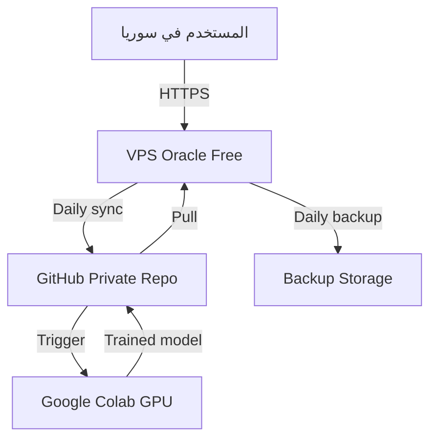

# HYBRID ARCHITECTURE — VPS ↔ GitHub ↔ Colab (PLANNED)

**الحالة: PLANNED — NOT IMPLEMENTED.** لم تُنشأ أي سحابة/خادم/خط أنابيب.

## المخطط

## أدوار المكوّنات

| المكوّن | الدور | المسؤوليات | الموارد | التكلفة | التواصل | حالة الفشل | النسخ الاحتياطي |
|---|---|---|---|---|---|---|---|
| **User** | مصحِّح/مشغّل | تصحيح HITL، إطلاق التدريب، قبول/رفض النموذج | متصفح | $0 | HTTPS فقط | يعمل offline على نسخ محلية | — |
| **VPS** | خادم دائم | correction/train servers، تقطيع PDF، cron للتصدير/السحب/الترقية، nginx+SSL | 4 ARM cores/24GB (تقريبي) | $0 (Always Free) | HTTPS خارجي؛ gh CLI + git نحو GitHub | توقف الخدمة؛ البيانات المحلية تُصدَّر يوميًا | daily → GitHub private + storage خارجي |
| **GitHub Private** | وسيط الحقيقة | datasets مشفرة (GPG)، releases للنماذج، Actions triggers، سجل كل شيء | — | $0 | git/gh/API | نادر؛ نسخ محلية + VPS | متعدد المواقع بطبيعته |
| **Colab** | عامل تدريب | فك تشفير dataset، تدريب TrOCR+AraBERT، تقييم CER، رفع النموذج لـReleases | GPU T4 حصص يومية | $0 (أو Pro ~$10-15/mo) | gh CLI سحب/رفع | انقطاع الجلسة → checkpoints + إعادة تشغيل | checkpoints تُرفع أثناء التدريب |
| **Backup Storage** | أرشيف بارد | نسخ مشفرة إضافية (B2/R2 — انظر ALTERNATIVES) | ~200GB | $0-1 | rclone/gh | — | هو النسخة |

## تدفق البيانات — الحالة 1: تصحيح يومي

1. المستخدم يفتح `https://<domain>/` (nginx → correction server على 127.0.0.1:5000).
2. يصحح قصاصات الكلمات؛ تُحفظ في `corrections.xlsx/db` محليًا على VPS.
3. cron ليلي: تصدير → **تشفير GPG** → push إلى مستودع datasets الخاص
   (`datasets/encrypted-<hash>.tar.gz.gpg` + manifest SHA256).
4. لا PHI غير مشفر يغادر VPS أبدًا (انظر [PRIVACY_COMPLIANCE.md](PRIVACY_COMPLIANCE.md)).

## تدفق البيانات — الحالة 2: تدريب دوري

1. Trigger (يدوي `workflow_dispatch` أو جدول) →Colab notebook يسحب أحدث dataset مشفر عبر `gh`.
2. فك التشفير **داخل ذاكرة Colab** بمفتاح GPG مخزن كـColab Secret (لا على القرص).
3. تدريب (4-6h تقديريًا لقاعدة صغيرة على T4 — **تقدير UNVERIFIED**) مع checkpoints.
4. تقييم CER/WER على split الاختبار → رفع `trocr-arabic-v<n>.safetensors` + metrics.json إلى GitHub Release.
5. VPS (cron أسبوعي): سحب → **تحقق SHA256** → validate_model (50 عينة مختارة) →
   **promote أو rollback** تلقائيًا بقرار موثق.

## حدود معمارية صريحة

- VPS بلا GPU → لا تدريب عليه (استدلال CPU خفيف فقط).
- Colab جلسات مؤقتة → الخط مصمم stateless/cancellable.
- GitHub حد مستودع عملي (~1-5GB؛ datasets مشفرة مضغوطة + Git LFS إن لزم —
  **Source:** https://docs.github.com/repositories/working-with-files/managing-large-files · UNVERIFIED).
- فشل أي عقدة لا يفقد بيانات (كل حالة لها نسخة سابقة + rollback).
