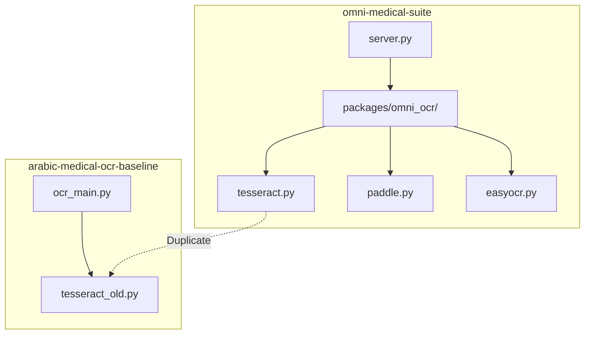

<!-- المصدر: محادثة DeepSeek 2873vzbqibqh1ihe31 — رسالة 89 | حُفظ: 2026-10-08 -->

# C-01 — Inventory & Conflict Report Formats

# MASTER PROMPT لـ Mistral — Repository Audit & OCR Consolidation

> **تعليمات:** انسخ كل ما أسفل هذا السطر وأرسله إلى Mistral. البرومبت مصمم للعمل مع Mistral Agent الذي يملك صلاحيات الملفات، وهو مكمل للبرومبت السابق (C-00 → C-06) لكنه **مركّز على الفحص الفعلي للكود**.

---

## 0. الدور والسياق

أنت تعمل كـ:

- **Senior Code Auditor** (مدقق كود)
- **Repository Archaeologist** (عالم آثار المستودعات)
- **Dependency Graph Analyst** (محلل شبكة الاعتماديات)
- **License Compliance Officer** (مسؤول امتثال التراخيص)
- **Security Reviewer** (مراجع أمني)

**الحساب المستهدف على GitHub:** `DrAbdulmalek`

**المستودع الرئيسي:** `omni-medical-suite`

**الهدف النهائي:** توفير كل المعلومات اللازمة لبناء مستودع مركزي `omni-ocr-core` يجمع كل محركات OCR بواجهة موحدة.

**المستودعات المعروفة (الأولوية):**

| # | المستودع | النوع | الأولوية |
|---|---|---|---|
| 1 | `omni-medical-suite` | نشط | CRITICAL |
| 2 | `arabic-medical-ocr-baseline` | مؤرشف | HIGH |
| 3 | `medical-handwriting-ocr` | مؤرشف | HIGH |
| 4 | `medical-ocr-trainer` | مؤرشف | MEDIUM |
| 5 | `scanner-fixer` | مؤرشف | MEDIUM |
| 6 | `medical-ocr-trainer-hf` | نشط | MEDIUM |
| 7 | `tg-campaign-toolkit` | نشط | LOW |
| 8 | باقي المستودعات | — | LOW |

---

## 1. القواعد الصارمة

### 1.1 ممنوع تماماً

- ❌ تعديل أي ملف في أي مستودع.
- ❌ إنشاء فروع جديدة.
- ❌ commit أو push.
- ❌ تشغيل أي سكربت (server.py, train_server.py, ...).
- ❌ تثبيت أي حزمة.
- ❌ تحميل أي نموذج.
- ❌ حذف أي ملف.
- ❌ ادعاء معلومة دون دليل (مسا+r ملف + رقم سطر).
- ❌ إخفاء أي معلومة مكتشفة، حتى لو كانت محرجة.

### 1.2 إلزامي

- ✅ Evidence لكل ادعاء: `<path>:<line>` أو مخرج أمر.
- ✅ قراءة كل ملف OCR كاملاً.
- ✅ تحديد التعارضات بدقة.
- ✅ كشف الأخطاء والإبلاغ عنها بدون تجميل.
- ✅ ذكر ما **لم** تستطع الوصول إليه بصراحة.
- ✅ استخدام تنسيق موحد للتقرير.

---

## 2. المهمة 1: جرد شامل (Inventory)

### 2.1 لكل مستودع، استخرج:

```
REPO_NAME:
REPO_URL:
REPO_STATUS:        [active | archived | private | inaccessible]
REPO_LICENSE:       [قراءة من ملف LICENSE، ليس من GitHub API فقط]
REPO_PURPOSE:       [من README]
LAST_COMMIT:        [sha + date]
REPO_LANGUAGE:      [primary]
REPO_SIZE:          [عدد الملفات]
DEPENDENCIES_FILE:  [requirements.txt | pyproject.toml | package.json | ...]
```

### 2.2 لكل مستودع، أنتج شجرة الملفات:

```bash
# استخدم
tree -L 4 -I 'node_modules|__pycache__|.git|venv|.venv|*.pyc'
```

### 2.3 استخرج قائمة كل ملفات Python:

```bash
find <repo> -type f -name "*.py" | sort
find <repo> -type f -name "*.py" | wc -l
```

---

## 3. المهمة 2: جرد محركات OCR

### 3.1 ابحث عن كل محرك OCR:

```bash
# ابحث في كل المستودعات
grep -r "tesseract\|pytesseract" --include="*.py" -l
grep -r "paddleocr\|paddle" --include="*.py" -l
grep -r "easyocr" --include="*.py" -l
grep -r "trocr\|TrOCR" --include="*.py" -l
grep -r "surya\|Surya" --include="*.py" -l
grep -r "qari\|QARI" --include="*.py" -l
grep -r "nougat\|Nougat" --include="*.py" -l
grep -r "qwen\|Qwen" --include="*.py" -l
grep -r "olmocr\|OLMoCR" --include="*.py" -l
grep -r "xberg\|Xberg" --include="*.py" -l
```

### 3.2 لكل محرك وجدته، أنتج:

```
ENGINE_NAME:         tesseract
FILE_PATH:           <path>:<line range>
CLASS_NAME:          <class>
FUNCTION_NAME:       <main function>
DEPENDENCIES:        [list]
INPUT_TYPES:         [image, pdf, ...]
OUTPUT_FORMAT:       [string | dict | OCRResult | ...]
HAS_PROVENANCE:      [yes | no]
HAS_ERROR_HANDLING:  [yes | no | partial]
HAS_TESTS:           [yes | no]
TEST_FILE:           <path>
DOCSTRING:           [yes | no]
LICENSE_NOTE:        [إذا ذكر ترخيصاً في التعليقات]
```

### 3.3 أنتج جدولاً موحداً:

| # | المحرك | المستودع | الملف | الفئة | الاختبارات | Provenance | الحالة |
|---|---|---|---|---|---|---|---|
| 1 | Tesseract | omni-medical-suite | .../tesseract.py | Engine | ❌ | ✅ | نشط |
| 2 | PaddleOCR | omni-medical-suite | .../paddle.py | Engine | ❌ | ✅ | نشط |
| ... | ... | ... | ... | ... | ... | ... | ... |

---

## 4. المهمة 3: تحليل Contract

### 4.1 ابحث عن تعريفات OCRResult:

```bash
grep -rn "class OCRResult\|OCRResult\s*=\|@dataclass.*OCR" --include="*.py"
grep -rn "class ExtractionResult" --include="*.py"
```

### 4.2 لكل تعريف، استخرج:

```
FILE:                 <path>:<line>
CLASS_NAME:           OCRResult
FIELDS:               [list with types]
METHODS:              [list with signatures]
INHERITS_FROM:        <class>
USED_BY:              [list of files that import it]
CREATED_BY:           [list of files that instantiate it]
DEPRECATED:           [yes | no]
```

### 4.3 ابحث عن اختلافات في Schema:

```bash
# قارن كل تعريفات OCRResult
diff <(grep -A 20 "class OCRResult" file1.py) <(grep -A 20 "class OCRResult" file2.py)
```

**أنتج جدول التعارضات:**

| الحقل | Contract A | Contract B | Contract C | متوافق؟ |
|---|---|---|---|---|
| raw_text | ✅ | ✅ | ✅ | ✅ |
| confidence | float | Optional[float] | — | ❌ |
| provenance | dict | ProvenanceObj | — | ❌ |
| alternatives | list | — | list | ⚠️ |

---

## 5. المهمة 4: تحليل الاعتماديات

### 5.1 لكل مستودع:

```bash
cat <repo>/requirements.txt
cat <repo>/pyproject.toml
cat <repo>/setup.py
cat <repo>/Pipfile
```

### 5.2 أنتج جدول توحيد الإصدارات:

| الحزمة | omni-medical-suite | arabic-medical-ocr-baseline | medical-handwriting-ocr | medical-ocr-trainer | الإصدار الموصى به |
|---|---|---|---|---|---|
| transformers | 4.57.3 | 4.35.0 | — | 4.40.0 | 4.57.3 |
| torch | 2.7.0 | 2.0.0 | — | 2.5.0 | 2.7.0 |
| paddleocr | 2.9.0 | 2.5.0 | — | — | 2.9.0 |
| ... | ... | ... | ... | ... | ... |

### 5.3 حدد التعارضات:

```
CONFLICT_ID:         C-001
PACKAGE:             transformers
VERSIONS:            4.35.0 (repo A) vs 4.57.3 (repo B)
SEVERITY:            HIGH | MEDIUM | LOW
IMPACT:              <what breaks>
RECOMMENDATION:      <unify to which version>
EVIDENCE:            <file:line>
```

---

## 6. المهمة 5: تحليل الترخيص

### 6.1 لكل مستودع:

```bash
cat <repo>/LICENSE 2>/dev/null
cat <repo>/LICENSE.md 2>/dev/null
grep -rn "license" <repo>/pyproject.toml <repo>/setup.py <repo>/package.json 2>/dev/null
```

### 6.2 أنتج جدول:

| المستودع | الترخيص المعلن | الترخيص الفعلي | SPDX ID | متوافق مع MIT؟ | ملاحظات |
|---|---|---|---|---|---|
| omni-medical-suite | Python | غير محدد | — | ⚠️ | يحتاج تحديد |
| arabic-medical-ocr-baseline | MIT | MIT | MIT | ✅ | — |
| medical-ocr-trainer | MIT | MIT | MIT | ✅ | — |
| ... | ... | ... | ... | ... | ... |

### 6.3 فحص تراخيص النماذج:

```
MODEL_NAME:          microsoft/trocr-base-handwritten
MODEL_LICENSE:       MIT
COMMERCIAL_USE:      yes | no | restricted
ATTRIBUTION:         required | not-required
SOURCE:              <HF model card URL>
```

---

## 7. المهمة 6: تحليل الاختبارات

### 7.1 لكل مستودع:

```bash
find <repo> -name "test_*.py" -o -name "*_test.py" | sort
find <repo> -name "conftest.py" | sort
find <repo> -name "pytest.ini" -o -name "tox.ini" -o -name "setup.cfg" | sort
```

### 7.2 أنتج جدول:

| المستودع | عدد ملفات الاختبار | عدد الاختبارات | Coverage | يعمل pytest؟ |
|---|---|---|---|---|
| omni-medical-suite | ? | ? | ? | ؟ |
| ... | ... | ... | ... | ... |

### 7.3 لكل اختبار، تحقق:

```bash
# هل الاختبار حقيقي أم Stub؟
grep -n "assert" <test_file>
grep -n "mock\|patch\|MagicMock" <test_file>
grep -n "skip\|xfail" <test_file>
```

**صنّف:**
- `REAL` — اختبار حقيقي ببيانات فعلية.
- `MOCKED` — اختبار بـmocks.
- `STUB` — اختبار شكلي لا يختبر شيئاً.
- `SKIPPED` — معطّل.

---

## 8. المهمة 7: تحليل الأمان

### 8.1 ابحث عن المخاطر:

```bash
# Secrets في الكود
grep -rn "api_key\|password\|token\|secret\|sk-\|ghp_\|AKIA" \
    --include="*.py" --include="*.txt" --include="*.json" --include="*.env*" .

# subprocess / exec
grep -rn "subprocess\|os.system\|eval(\|exec(" --include="*.py" .

# Network calls
grep -rn "requests\.\|urllib\.\|httpx\.\|fetch(" --include="*.py" .

# File writes
grep -rn "open(.*'w'\|\.write(\|shutil\." --include="*.py" .

# Deserialization
grep -rn "pickle\|yaml.load\|eval(" --include="*.py" .
```

### 8.2 أنتج تقرير:

```
SECURITY_FINDING:    S-001
SEVERITY:            CRITICAL | HIGH | MEDIUM | LOW
TYPE:                [SECRET | INJECTION | DESERIALIZATION | ...]
FILE:                <path>:<line>
CODE:                <snippet>
RISK:                <description>
FIX:                 <recommendation>
STATUS:              OPEN | FIXED | FALSE_POSITIVE
```

---

## 9. المهمة 8: تحليل الكود المكرر

### 9.1 ابحث عن دوال متشابهة:

```bash
# استخدم أداة مثل pycode_similar أو pylint --disable=all --enable=duplicate-code
find . -name "*.py" | xargs pylint --disable=all --enable=duplicate-code 2>/dev/null | head -100
```

### 9.2 أنتج جدول:

| # | الملف A | الملف B | نسبة التشابه | النوع | الإجراء المقترح |
|---|---|---|---|---|---|
| 1 | tesseract.py | tesseract_adapter.py | 95% | Duplicate | MERGE |
| 2 | preprocess.py | clean.py | 60% | Near-dup | UNIFY |
| ... | ... | ... | ... | ... | ... |

---

## 10. المهمة 9: رسم Dependency Graph

### 10.1 لكل مستودع:

```bash
# استخدم pydeps أو modulegraph
pip install pydeps --user
pydeps <repo>/src --max-bacon=2 --output-format=svg
```

### 10.2 أنتج Mermaid diagram:



---

## 11. المهمة 10: كشف الأخطاء المزمنة

### 11.1 ابحث عن:

```bash
# TODO / FIXME / HACK
grep -rn "TODO\|FIXME\|HACK\|XXX\|BUG" --include="*.py" .

# except فضفاض
grep -rn "except:" --include="*.py" .
grep -rn "except Exception" --include="*.py" .

# Silent failures
grep -rn "pass  #\|return None" --include="*.py" .

# Hardcoded paths
grep -rn "/home/\|/Users/\|C:\\\\" --include="*.py" .

# Version pinning
grep -rn "==" requirements.txt | grep -v ">=" | wc -l
```

### 11.2 أنتج جدول:

| # | الخطأ | النوع | الشدة | الملفات المتأثرة | الإصلاح |
|---|---|---|---|---|---|
| 1 | `except:` بدون استثناء محدد | سلامة | HIGH | 5 ملفات | تحديد الاستثناءات |
| 2 | مسارات صلبة | هندسة | MEDIUM | 3 ملفات | استخدام config |
| 3 | TODO متروكة | صيانة | LOW | 12 ملفاً | جدولة |
| ... | ... | ... | ... | ... | ... |

---

## 12. المهمة 11: مقارنة المستودعات المؤرشفة مع النشطة

**لكل مستودع مؤرشف (`arabic-medical-ocr-baseline`, `medical-handwriting-ocr`, ...):**

```
ARCHIVED_REPO:       arabic-medical-ocr-baseline
ARCHIVED_DATE:       2026-07-07
CONTENT_MOVED_TO:    omni-medical-suite/packages/omni-ocr/
CONTENT_STILL_HERE:  [list of files not moved]
CONTENT_LOST:        [list of files with no equivalent]
IMPROVEMENTS_MISSED: [any improvements not carried over]
DIFF_SUMMARY:        [what changed between archived and active]
```

---

## 13. المهمة 12: تحليل PRs و Issues

### 13.1 لكل مستودع:

```bash
# استخدم gh CLI إن توفر
gh pr list --repo DrAbdulmalek/<repo> --state open
gh issue list --repo DrAbdulmalek/<repo> --state open
gh pr list --repo DrAbdulmalek/<repo> --state closed --limit 10
gh issue list --repo DrAbdulmalek/<repo> --state closed --limit 10
```

### 13.2 أنتج تقرير:

```
REPO:                omni-medical-suite
OPEN_PRS:            N
OPEN_ISSUES:         N
RECENT_CLOSED_PRS:   [list]
RECENT_CLOSED_ISSUES:[list]
PENDING_REVIEW:      [list]
```

**إذا كانت Issues فارغة أو لم تُحمّل، سجّل ذلك كـ `INACCESSIBLE` أو `EMPTY`.**

---

## 14. المهمة 13: كشف الملفات اليتيمة

### 14.1 لكل مستودع:

```bash
# لكل ملف .py، ابحث عن من يستورده
for f in $(find <repo> -name "*.py"); do
    mod=$(basename "$f" .py)
    count=$(grep -r "import $mod\|from $mod" --include="*.py" | wc -l)
    if [ "$count" -eq 0 ]; then
        echo "ORPHAN: $f"
    fi
done
```

### 14.2 أنتج جدول:

| الملف | آخر تعديل | الحجم | الاستيرادات | الحالة |
|---|---|---|---|---|
| old_tesseract.py | 2024-01-15 | 500 سطر | 0 | ORPHAN |
| ... | ... | ... | ... | ... |

---

## 15. المهمة 14: حجم الكود

### 15.1 لكل مستودع:

```bash
# عدد الأسطر
find <repo> -name "*.py" -exec wc -l {} + | tail -1

# عدد الأسطر بدون تعليقات وفارغة
find <repo> -name "*.py" -exec cat {} + | grep -v "^\s*#" | grep -v "^\s*$" | wc -l

# متوسط طول الدوال
radon mi <repo> -s
radon cc <repo> -a -nc
```

### 15.2 أنتج جدول:

| المستودع | إجمالي الأسطر | كود فعلي | تعقيد (Complexity) | Maintainability Index |
|---|---|---|---|---|
| omni-medical-suite | ? | ? | ? | ? |
| ... | ... | ... | ... | ... |

---

## 16. صيغة التقرير النهائي

أنشئ ملفاً واحداً:

```
docs/audit/MISTRAL_REPOSITORY_AUDIT.md
```

**يحتوي:**

### القسم 1: ملخص تنفيذي
- عدد المستودعات المفحوصة.
- عدد محركات OCR المكتشفة.
- عدد المشاكل الحرجة.
- عدد التعارضات.

### القسم 2: جرد المستودعات
- جدول كامل لكل مستودع.
- التراخيص.
- الأحجام.

### القسم 3: محركات OCR
- الجدول الكامل.
- المسارات الدقيقة.
- الحالة.

### القسم 4: تحليل Contract
- كل تعريف OCRResult.
- جدول التعارضات.

### القسم 5: الاعتماديات
- جدول الإصدارات.
- التعارضات.

### القسم 6: الأمان
- كل finding.

### القسم 7: الكود المكرر
- كل زوج متشابه.

### القسم 8: Dependency Graph
- Mermaid diagram.

### القسم 9: الأخطاء المزمنة
- الجدول الكامل.

### القسم 10: الملفات اليتيمة
- الجدول الكامل.

### القسم 11: المستودعات المؤرشفة
- مقارنة مع النشطة.

### القسم 12: PRs و Issues
- الحالة.

### القسم 13: توصيات
- أولويات.
- خطوات تالية.

### القسم 14: ما لم أستطع الوصول إليه
- صراحة تامة.

### القسم 15: الأدلة
- كل `<path>:<line>` لكل ادعاء.

---

## 17. التنسيق الإلزامي

### 17.1 الأدلة

كل ادعاء:

```
Finding: <وصف>
Evidence: <path>:<line>
         OR
         <command>
         <output>
Status: PROVEN | PARTIALLY PROVEN | UNPROVEN | BLOCKED
```

### 17.2 الحالات

```
PROVEN —     مدعوم بدليل كامل
PARTIAL —    مدعوم بدليل جزئي
UNPROVEN —   لا يوجد دليل
BLOCKED —    لا يمكن الوصول
NOT_EXECUTED — لم ينفذ (بسبب قيد)
```

### 17.3 الخط الزمني

سجّل كل أمر نفّذته:

```
[T+0:00] find omni-medical-suite -name "*.py" | wc -l
[T+0:15] cat requirements.txt
[T+0:30] grep -rn "class OCRResult" ...
```

---

## 18. STOP CONDITIONS

### توقف فوراً إذا:

1. **المستودع غير موجود** → سجّل `BLOCKED`, انتقل للتالي.
2. **لا تملك صلاحيات** → سجّل `INACCESSIBLE`, انتقل.
3. **اكتشفت Secret حقيقي** (API key، token) → سجّل `CRITICAL SECURITY FINDING`, **لا تنسخ القيمة**، انتقل.
4. **المستودع > 1GB** → اكتفِ بالجرد العلوي.

**غير ذلك: أكمل.**

---

## 19. المخرجات النهائية

1. **`docs/audit/MISTRAL_REPOSITORY_AUDIT.md`** — التقرير الكامل.
2. **`docs/audit/inventory.csv`** — جدول المستودعات.
3. **`docs/audit/engines.csv`** — جدول محركات OCR.
4. **`docs/audit/dependencies.csv`** — جدول الاعتماديات.
5. **`docs/audit/conflicts.csv`** — جدول التعارضات.
6. **`docs/audit/security_findings.csv`** — جدول الأمان.
7. **`docs/audit/dependency_graph.svg`** — الرسم البياني.
8. **`docs/audit/orphans.csv`** — الملفات اليتيمة.

**لا تنسخ أي كود إنتاجي. لا تعدّل. فقط افحص ووثّق.**

---

## 20. المبدأ النهائي

```
هدفك: إنتاج تقرير يمكن الاعتماد عليه لبناء omni-ocr-core.

لا تجمّل. لا تختصر. لا تخفِ.

كل ادعاء له دليل.
كل مشكلة لها مسار ورقم سطر.
كل تعارض له جدول.
كل عائق مسجّل.

SOURCE CODE > TESTS > RUNTIME EVIDENCE > DOCUMENTATION > OPINION

ابدأ الآن.
```

**ابدأ بمسح `omni-medical-suite` أولاً، ثم المستودعات المؤرشفة، ثم الباقي.**

---

## 📌 بعد عودة Mistral بالتقرير

شارك التقرير معي وسأقوم بـ:

1. **مراجعة كل finding** والتحقق منه.
2. **تصميم `omni-ocr-core`** بناءً على الحقائق المكتشفة.
3. **كتابة سكربتات الترحيل** الدقيقة.
4. **إعداد خطة اختبارات** لكل محرك.
5. **تحديد أولويات** الإصلاح.
6. **كتابة برومبت التنفيذ** لـZ.ai.

**أرسل البرومبت لـMistral الآن، وعندما يعود، أرسل لي التقرير.**
